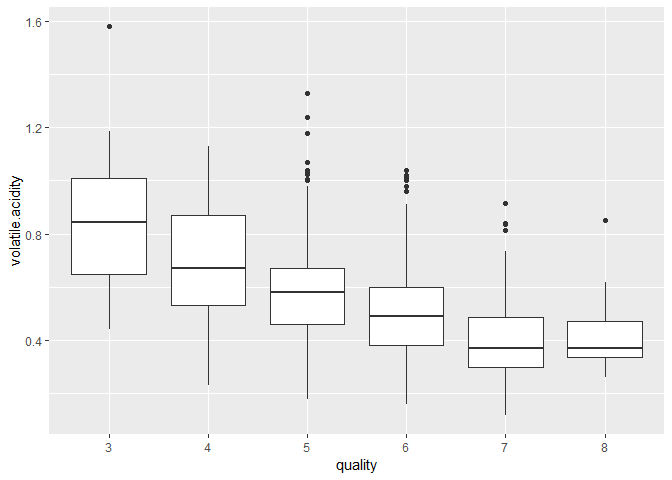

# 1.Inroduction

This report explores and analyzes a data set containing 1,599 red wines with 11
input attributes on the chemical proporties of the wine and 1 output attributes which is quality. In the first section I will explore the charactersistics of each attribute through univariate analysis. Then, through bivariate exploration, I will study the relation between each of the 11 indvidual attributes and the wine quality to understand which input attribute contributes more to the quality of the wine and whether some input attributes can have correlations with each others. On the last step before concluding the summary of my analysis, I will examine the interaction between 3 different attributes, consisting of 2 inputs vs. the quality through multivariate analysis.  


```r
# Loading needed packages all of the packages.
library(ggplot2)
library(corrplot)
library(memisc)
library(moments)
```


```r
# Loading the Dataset.
data_file <- 'wineQualityReds.csv'
df_wine <- read.csv(data_file)
```


# 2.Univariate Plots Section


```r
# Exploring the dimensions of the dataset.
dim(df_wine)
```

```
## [1] 1599   13
```


```r
# Explore the data type of each attribute.
str(df_wine)
```

```
## 'data.frame':	1599 obs. of  13 variables:
##  $ X                   : int  1 2 3 4 5 6 7 8 9 10 ...
##  $ fixed.acidity       : num  7.4 7.8 7.8 11.2 7.4 7.4 7.9 7.3 7.8 7.5 ...
##  $ volatile.acidity    : num  0.7 0.88 0.76 0.28 0.7 0.66 0.6 0.65 0.58 0.5 ...
##  $ citric.acid         : num  0 0 0.04 0.56 0 0 0.06 0 0.02 0.36 ...
##  $ residual.sugar      : num  1.9 2.6 2.3 1.9 1.9 1.8 1.6 1.2 2 6.1 ...
##  $ chlorides           : num  0.076 0.098 0.092 0.075 0.076 0.075 0.069 0.065 0.073 0.071 ...
##  $ free.sulfur.dioxide : num  11 25 15 17 11 13 15 15 9 17 ...
##  $ total.sulfur.dioxide: num  34 67 54 60 34 40 59 21 18 102 ...
##  $ density             : num  0.998 0.997 0.997 0.998 0.998 ...
##  $ pH                  : num  3.51 3.2 3.26 3.16 3.51 3.51 3.3 3.39 3.36 3.35 ...
##  $ sulphates           : num  0.56 0.68 0.65 0.58 0.56 0.56 0.46 0.47 0.57 0.8 ...
##  $ alcohol             : num  9.4 9.8 9.8 9.8 9.4 9.4 9.4 10 9.5 10.5 ...
##  $ quality             : int  5 5 5 6 5 5 5 7 7 5 ...
```


```r
# Convert quality to ordered variable
df_wine$quality <- ordered(df_wine$quality)
```


```r
# Explore some statistics
summary(df_wine)
```

```
##        X          fixed.acidity   volatile.acidity  citric.acid   
##  Min.   :   1.0   Min.   : 4.60   Min.   :0.1200   Min.   :0.000  
##  1st Qu.: 400.5   1st Qu.: 7.10   1st Qu.:0.3900   1st Qu.:0.090  
##  Median : 800.0   Median : 7.90   Median :0.5200   Median :0.260  
##  Mean   : 800.0   Mean   : 8.32   Mean   :0.5278   Mean   :0.271  
##  3rd Qu.:1199.5   3rd Qu.: 9.20   3rd Qu.:0.6400   3rd Qu.:0.420  
##  Max.   :1599.0   Max.   :15.90   Max.   :1.5800   Max.   :1.000  
##  residual.sugar     chlorides       free.sulfur.dioxide
##  Min.   : 0.900   Min.   :0.01200   Min.   : 1.00      
##  1st Qu.: 1.900   1st Qu.:0.07000   1st Qu.: 7.00      
##  Median : 2.200   Median :0.07900   Median :14.00      
##  Mean   : 2.539   Mean   :0.08747   Mean   :15.87      
##  3rd Qu.: 2.600   3rd Qu.:0.09000   3rd Qu.:21.00      
##  Max.   :15.500   Max.   :0.61100   Max.   :72.00      
##  total.sulfur.dioxide    density             pH          sulphates     
##  Min.   :  6.00       Min.   :0.9901   Min.   :2.740   Min.   :0.3300  
##  1st Qu.: 22.00       1st Qu.:0.9956   1st Qu.:3.210   1st Qu.:0.5500  
##  Median : 38.00       Median :0.9968   Median :3.310   Median :0.6200  
##  Mean   : 46.47       Mean   :0.9967   Mean   :3.311   Mean   :0.6581  
##  3rd Qu.: 62.00       3rd Qu.:0.9978   3rd Qu.:3.400   3rd Qu.:0.7300  
##  Max.   :289.00       Max.   :1.0037   Max.   :4.010   Max.   :2.0000  
##     alcohol      quality
##  Min.   : 8.40   3: 10  
##  1st Qu.: 9.50   4: 53  
##  Median :10.20   5:681  
##  Mean   :10.42   6:638  
##  3rd Qu.:11.10   7:199  
##  Max.   :14.90   8: 18
```

The redwine dataset contains 1599 observatios and 12 variables (11 input and 1 output)


## 2.1 Quality

```r
# Plot the distribution of quality usig bar plot.
ggplot(aes(x=quality),data=df_wine) + geom_bar()
```

<!-- -->

The quality score range is from 0 to 10. The plot shows that the majority of the observations have a quality of either 5 or 6, while very few scores as of very high quality (8) or very low quality (0) and none of the samples show any extremes of having quality of 0 or 10. In the following sections I would like to delve deeper in to this observation to understand the common factors that lead to this output.


## 2.2 Fixed Acidity

```r
# Plotting the distribution of fixed acidity using histogram.
ggplot(aes(x=fixed.acidity),data=df_wine)+geom_histogram(bins=50)
```

<!-- -->

Most of the fixed acidity values range between 6 and 8 and he distribution is left skewed.


## 2.3 Volatile Acidity

```r
ggplot(aes(x=volatile.acidity),data=df_wine)+geom_histogram(bins = 50) + scale_x_continuous(limits = c(0, 1))
```

<!-- -->

Most values range from 0.25 to 0.75.


## 2.4 Citric Acid

```r
ggplot(aes(x=citric.acid),data=df_wine)+geom_histogram(bins = 50)
```

<!-- -->

The majority of citric acid samples falls below 0.6, keeping into consideration the 132 observations have no citric acid recorded. 


## 2.5 Residual Sugar

```r
ggplot(aes(x=residual.sugar),data=df_wine)+geom_histogram(bins = 50)
```

<!-- -->


```r
skewness(df_wine$residual.sugar)
```

```
## [1] 4.536395
```

The residual sugar distribution is highly skewed to the left with the majority of samples are between 1 and 4. Possible existence of outliers.


## 2.6 Chlorides

```r
ggplot(aes(x= chlorides),data=df_wine)+geom_histogram(bins = 50)+ scale_x_continuous(limits = c(0, 0.2))
```

<!-- -->

After trimming values above 0.2, Chlorides looks normally distributed around a value of 0.075.


## 2.7 Free Sulfur Dioxide

```r
ggplot(aes(x=free.sulfur.dioxide),data=df_wine)+geom_histogram(bins = 50)
```

<!-- -->

```r
skewness(df_wine$free.sulfur.dioxide)
```

```
## [1] 1.249394
```

Another left-skewed attribute.


## 2.8 Total Sulfur Dioxide

```r
ggplot(aes(x=total.sulfur.dioxide),data=df_wine)+geom_histogram(bins = 50)
```

<!-- -->


```r
skewness(df_wine$total.sulfur.dioxide)
```

```
## [1] 1.514109
```

Total Sulfar dioxide is also left skewed.


## 2.9 Density

```r
ggplot(aes(x=density),data=df_wine)+geom_histogram(bins = 50)
```

<!-- -->

```r
skewness(df_wine$density)
```

```
## [1] 0.07122077
```

Density is normally distributed.


## 2.10 pH

```r
ggplot(aes(x=pH),data=df_wine)+geom_histogram(bins = 50)
```

<!-- -->

```r
skewness(df_wine$pH)
```

```
## [1] 0.1935018
```

pH also is almost normally distributed.


## 2.11 Sulphates

```r
ggplot(aes(x=sulphates),data=df_wine)+geom_histogram(bins = 50)
```

<!-- -->


```r
quantile(df_wine$sulphates)
```

```
##   0%  25%  50%  75% 100% 
## 0.33 0.55 0.62 0.73 2.00
```

Sulphates plot is left-skewed with most values between 0.55 and 0.73.


## 2.12 Alcohol

```r
ggplot(aes(x=alcohol),data=df_wine)+geom_histogram(bins = 50)
```

<!-- -->


```r
quantile(df_wine$alcohol)
```

```
##   0%  25%  50%  75% 100% 
##  8.4  9.5 10.2 11.1 14.9
```

The majority of alcohol concentration lies between 9.5 and 11.1


# 3.Univariate Analysis

### 3.1 What is the structure of your dataset?

The Dataset contains 1599 instances of redwine with 12 attributes 11 of them are input attributes, namely (fixed acidity, volatile acidity, citric acid, residual sugar, chlorides, free sulfur dioxide, total sulfur dioxide, density, pH, sulphates, alcohol) and they are based on physicochemical tests, and one output variable (Quality) that is based on sensory data.

### 3.2 What is/are the main feature(s) of interest in your dataset?

The main feature of interest is quality and the aim of this report is to study the influence of each of the 11 input attributes on wine quality.

### 3.3 What other features in the dataset do you think will help support your \
investigation into your feature(s) of interest?

Each input variable can contribute to the quality of wine and this is what I'm going to study in the upcoming sections.

### 3.4 Did you create any new variables from existing variables in the dataset?

No.

### 3.5 Of the features you investigated, were there any unusual distributions? \
Did you perform any operations on the data to tidy, adjust, or change the form \
of the data? If so, why did you do this?

I converted the qaulity variable from a numeric to an ordered factor since it's considered a categorical variable.


# 4.Bivariate Plots Section

## 4.1 Quality with Fixed Acidity


```r
# Box plotting fixed acidity on y axis vs. Quality on x axis
ggplot(df_wine, aes(x = quality, y = fixed.acidity)) + geom_boxplot()
```

<!-- -->

No clear pattern.


## 4.2 Quality with Volatile Acidity


```r
ggplot(df_wine, aes(x = quality, y = volatile.acidity)) + geom_boxplot()
```

<!-- -->

The lower the volatile acidity the higher the quality.


## 4.3 Quality with Citric Acid


```r
ggplot(df_wine, aes(x = quality, y = citric.acid)) + geom_boxplot()
```

<!-- -->

The higher the citric acid, the higher the quality.


## 4.4 Quality with Residual Sugar


```r
ggplot(df_wine, aes(x = quality, y = residual.sugar)) + geom_boxplot()
```

<!-- -->

No clear pattern.


## 4.5 Quality with Chlorides


```r
ggplot(df_wine, aes(x = quality, y = chlorides)) + geom_boxplot() + scale_y_continuous(limits=c(0,0.2))
```

<!-- -->

Quality slightly increases with lower chlorides.


## 4.6 Quality with Free Sulfur Dioxide


```r
ggplot(df_wine, aes(x = quality, y = free.sulfur.dioxide)) + geom_boxplot()
```

<!-- -->

No clear pattern.


## 4.7 Quality with total sulfur dioxide


```r
ggplot(df_wine, aes(x = quality, y = total.sulfur.dioxide)) + geom_boxplot()
```

<!-- -->

No clear pattern.


## 4.8 Quality with Density


```r
ggplot(df_wine, aes(x = quality, y = density)) + geom_boxplot()
```

<!-- -->

The lower the density the higher the quality.


## 4.9 Quality with pH


```r
ggplot(df_wine, aes(x = quality, y = pH)) + geom_boxplot()
```

<!-- -->

The lower the pH the higher the quality.


## 4.10 Quality with Sulphates


```r
ggplot(df_wine, aes(x = quality, y = sulphates)) + geom_boxplot()
```

<!-- -->

The higher the sulphates the higher the quality.


## 4.11 Quality with alcohol


```r
ggplot(df_wine, aes(x = quality, y = alcohol)) + geom_boxplot()
```

<!-- -->

The higher the alcohol the higher the quality.


## 4.12 Correlation Matrix  


```r
# Plotting correlation matrix.
corrplot(cor(df_wine[,2:12]),type = 'lower',tl.col = "black", tl.srt=15)
```

<!-- -->

From the correlation plot, I can notice some interesting relationships between some variable like fixed acidity vs. citric acid, density, and pH. Also citric acid vs. volatile acidity, and pH. And finally density vs. alcohol.


## 4.13 Fixed Acidity vs. Citric Acid 


```r
# Scatter plot with fixed acidity on x axis and citric acidity on y axis
ggplot(df_wine,aes(x=fixed.acidity, y= citric.acid)) +geom_point()
```

<!-- -->


```r
cor(df_wine$fixed.acidity,df_wine$citric.acid)
```

```
## [1] 0.6717034
```

There is a high positive correlation between fixed acidity and citric acid. This is expected because citric acid is one of the predominant fixed acids found in wines (https://waterhouse.ucdavis.edu/whats-in-wine/fixed-acidity).  


## 4.14 Fixed Acidity vs. Density 


```r
ggplot(df_wine,aes(x=fixed.acidity,y=density)) +geom_point()
```

<!-- -->


```r
cor(df_wine$fixed.acidity,df_wine$density)
```

```
## [1] 0.6680473
```

High positive correlation between fixed acidity and density.This is because the predominant fixed acids found in wines are tartaric, malic, citric, and succinic.  Their respective levels found in wine can vary greatly but in general one would expect to see 1,000 to 4,000 mg/L tartaric acid, 0 to 8,000 mg/L malic acid, 0 to 500 mg/L citric acid, and 500 to 2,000 mg/L succinic acid. And tartaric acid having the highest concentration, it has also the highest density of 1.79 g/ml compared to the rest of acids.


## 4.15 Fixed Acidity vs. pH 


```r
ggplot(df_wine,aes(x=fixed.acidity,y=pH)) +geom_point()
```

<!-- -->


```r
cor(df_wine$fixed.acidity, df_wine$pH)
```

```
## [1] -0.6829782
```

pH and fixed acidity are negatively correlated since lower the pH values means higher acidity.


## 4.16 Citric Acid with Volatile Acidity


```r
ggplot(df_wine,aes(x=citric.acid,y=volatile.acidity)) +geom_point()
```

<!-- -->


```r
cor(df_wine$citric.acid,df_wine$volatile.acidity)
```

```
## [1] -0.5524957
```

There's a negative correlation between citric acid and volatile acidity. It's a natural outcome, since traditionally total acidity is divided into two groups, namely the volatile acids and the fixed acids, and citric acid is one of the fixed acids.So one of them increases the other has to decrease.


## 4.17 Citric acid vs. pH

```r
ggplot(df_wine,aes(x=citric.acid,y=pH)) +geom_point()
```

<!-- -->


```r
cor(df_wine$citric.acid,df_wine$pH)
```

```
## [1] -0.5419041
```

Citric acid and pH are negatively correlated. This is natural since lower pH levels means higher acidity.


## 4.18 Density with Alcohol


```r
ggplot(df_wine,aes(x=density,y=alcohol)) +geom_point()
```

<!-- -->


```r
cor(df_wine$density,df_wine$alcohol)
```

```
## [1] -0.4961798
```
Density and alcohol are negatively correlated. This is because the density of alcohol is less than the density of water, so the higher the concentration of alcohol the lower the overall density of wine.


# 5.Bivariate Analysis

### 5.1 Talk about some of the relationships you observed in this part of the \
investigation. How did the feature(s) of interest vary with other features in \
the dataset?

It can be observed from the box plots, that Quality increases with the increase in citric acid, sulphates, and alcohol while decreases with the increase in Volatile acidity, chlorides, density,and pH. 


### 5.2 Did you observe any interesting relationships between the other features \
(not the main feature(s) of interest)?

- Fixed acidity and citric acid are positively correlated because citric acid is one of the components of fixed acids.
- The higher the density the higher the fixed acidity.
- pH is negatively correlated with fixed acidity (citric acid inclusively) since lower pH values means higher acidity.
- Volatile acidity increases with the decrease in citric acid since total acidity is divided in to these two, hence, one increases, the other has to decrease.
- Finally, the higher the concentration of alcohol the lower the wine density because the density of alcohol is lower than that of water, so higher alcohol concentration means lower overall density.


### 5.3 What was the strongest relationship you found?

The strongest relation is between quality and concentration of alcohol.


# 6.Multivariate Plots Section

## 6.1 Quality vs. Citric Acid and Volatile Acidity

```r
ggplot(df_wine,aes(x=citric.acid, y=volatile.acidity, color=quality))+geom_point(alpha=1/2)
```

<!-- -->

The lower the volatile acidity and the higher the citric acid, the higher the wine quality is.


## 6.2 Quality vs. Volatile Acidity and Alcohol

```r
ggplot(df_wine,aes(x=volatile.acidity, y=alcohol, color=quality))+geom_point(alpha=1/2)
```

<!-- -->

Lower volatile acidity and higher alcohol concentration leads to higher wine quality.


## 6.3 Quality vs. Volatile Acidity and Density

```r
ggplot(df_wine,aes(x=volatile.acidity, y=density, color=quality))+geom_point(alpha=1/2)
```

<!-- -->

Higher wine quality is associated with lower volatile acidity and lower density.


## 6.2 Quality vs. Volatile Acidity and pH

```r
ggplot(df_wine,aes(x=volatile.acidity, y=pH, color=quality))+geom_point(alpha=1/2)
```

<!-- -->

Higher wine quality is associated with lower volatile acidity and lower pH levels.


# 7.Linear Model


```r
# First linear model with only one input variable which is alcohol
m1 <-  lm(as.numeric(levels(quality))[quality] ~ alcohol, 
          data = df_wine)
# Adding volatile acidity, density and pH and create the second model
m2 <- update(m1, ~ . + volatile.acidity + density + pH)
# create the third model by adding the remaining attributes.
m3 <- update(m2, ~ . + sulphates + chlorides + citric.acid + fixed.acidity +                residual.sugar + free.sulfur.dioxide + total.sulfur.dioxide)
# Generatting the model predition table
mtable(m1, m2, m3, sdigits = 3)
```

```
## 
## Calls:
## m1: lm(formula = as.numeric(levels(quality))[quality] ~ alcohol, 
##     data = df_wine)
## m2: lm(formula = as.numeric(levels(quality))[quality] ~ alcohol + 
##     volatile.acidity + density + pH, data = df_wine)
## m3: lm(formula = as.numeric(levels(quality))[quality] ~ alcohol + 
##     volatile.acidity + density + pH + sulphates + chlorides + 
##     citric.acid + fixed.acidity + residual.sugar + free.sulfur.dioxide + 
##     total.sulfur.dioxide, data = df_wine)
## 
## ==================================================================
##                              m1            m2            m3       
## ------------------------------------------------------------------
##   (Intercept)               1.875***     -8.129        21.965     
##                            (0.175)      (10.751)      (21.195)    
##   alcohol                   0.361***      0.340***      0.276***  
##                            (0.017)       (0.019)       (0.026)    
##   volatile.acidity                       -1.277***     -1.084***  
##                                          (0.099)       (0.121)    
##   density                                12.214       -17.881     
##                                         (10.585)      (21.633)    
##   pH                                     -0.385**      -0.414*    
##                                          (0.119)       (0.192)    
##   sulphates                                             0.916***  
##                                                        (0.114)    
##   chlorides                                            -1.874***  
##                                                        (0.419)    
##   citric.acid                                          -0.183     
##                                                        (0.147)    
##   fixed.acidity                                         0.025     
##                                                        (0.026)    
##   residual.sugar                                        0.016     
##                                                        (0.015)    
##   free.sulfur.dioxide                                   0.004*    
##                                                        (0.002)    
##   total.sulfur.dioxide                                 -0.003***  
##                                                        (0.001)    
## ------------------------------------------------------------------
##   R-squared                 0.227         0.323         0.361     
##   adj. R-squared            0.226         0.322         0.356     
##   sigma                     0.710         0.665         0.648     
##   F                       468.267       190.368        81.348     
##   p                         0.000         0.000         0.000     
##   Log-likelihood        -1721.057     -1614.433     -1569.138     
##   Deviance                805.870       705.256       666.411     
##   AIC                    3448.114      3240.867      3164.277     
##   BIC                    3464.245      3273.129      3234.179     
##   N                      1599          1599          1599         
## ==================================================================
```

It's obvious that alcohol concentration plays a major role in the quality of wine reflected by a high R-squared value of 0.227. Adding the Volatile acidity, density, and pH adds a significant contirbution, raising the R-squared value by 0.096 .However, the remaining attributes don't add much value.


# 8.Multivariate Analysis

### 8.1 Talk about some of the relationships you observed in this part of the \
investigation. Were there features that strengthened each other in terms of \
looking at your feature(s) of interest?

It's clear that multiple inputs can be used to tell how good or bad the quality of the wine is. Using alcohol and volatile acidity is one clear example, were wine quality increases when we have lower volatile acidity and higher alcohol concentration. 

### 8.2 Were there any interesting or surprising interactions between features?

It can be noticed that alcohol plays a major role in determining wine quality followed by volatile acidity, density and pH.

### 8.3 OPTIONAL: Did you create any models with your dataset? Discuss the \
strengths and limitations of your model.

I used linear model which is simple and straight forward to interpret but it's simplicity could be a limitation and using more complex models can give better predictions.

------

# 9.Final Plots and Summary

### 9.1 Plot One


```r
ggplot(aes(x=quality),data=df_wine) + geom_bar(color="#363399",fill= "#363399") + 
  xlab('Quality') +
  ylab('Count Of Samples') +
  geom_text(stat='count', aes(label=..count..), vjust=-0.2) +
  ggtitle('Distribution Of Quality Values') +
# Remove grid, background, and axis lines. Center the title.
  theme(panel.grid.major = element_blank(), panel.grid.minor = element_blank(),
panel.background = element_blank(),plot.title = element_text(hjust = 0.5))
```

<!-- -->


### 9.2 Description One

Most of the observations in the redwine dataset have quality of 5 or 6, with some few samples of either very high or very low qualities (3 and 8 respectively) and absolutely no records of extremely bad or extermely good redwine represented by a quality score of 0 and 10 respectively.

### 9.3 Plot Two

```r
ggplot(df_wine, aes(x = quality, y = alcohol, fill = quality)) +
  geom_boxplot()+theme(legend.position="none") +
  scale_fill_brewer(palette="OrRd") +
  xlab('Quality Score') +
  ylab('Alcohol (% by volume)') +
  ggtitle('Quality Vs. Alcohol Concentration') +
  theme(panel.grid.major = element_blank(), panel.grid.minor = element_blank(),
panel.background = element_blank(),plot.title = element_text(hjust = 0.5))
```

<!-- -->

### 9.4 Description Two

From analysis it can be concluded that Alcohol concentration plays a major role in determining the quality of the wine. The higher the concentration the better the quality score. 

### 9.5 Plot Three

```r
ggplot(df_wine,aes(x=volatile.acidity, y=alcohol, color=quality))+geom_point(alpha=1/2) +
  scale_x_continuous(limits = c(min(df_wine$volatile.acidity), 
                                quantile(df_wine$volatile.acidity, 0.99))) +
  scale_y_continuous(limits = c(min(df_wine$alcohol), 
                                quantile(df_wine$alcohol, 0.99))) +
  scale_color_brewer(type = 'div', name = 'Quality')+
  xlab('Volatile Acidity (g / dm^3)') +
  ylab('Alcohol (% by volume)') +
  ggtitle('Quality Vs. Alcohol And Volatile Acidity') +
  theme(panel.grid.major = element_blank(), panel.grid.minor = element_blank(),
panel.background = element_blank(),plot.title = element_text(hjust = 0.5))
```

<!-- -->


### 9.6 Description Three

High Quality is associated with high alcohol concentration and low volatile acidity -dark green points on the top left corner of the plot. Low Quality is associated with low concentration of alcohol and high volatile acidity -brown points on the bottom right corner of the chart.

------

# 10.Reflection

In this dataset I have analyzed the redwine dataset which consists of 1599 observations with 12 different attributes, of which 11 are input attributes controlling the remaining output attribute which is quality. I have explored these variable through different analysis techniques like univariate analysis, bi-variate analysis and multivariate analysis. I have also used a linear prediction model to investigate the most contributing input variables to wine quality, which turned out to be Alcohol, followed by Volatile acidity, density, and pH.

The code I used wasn't the cleanest, as I had to repeat the plotting code for each plot and that was a dummy work. In future versions, I will figure out a function that can loop through variables and generate the needed plots with a single piece of code. I will also refine the prediction model and try to explore more complex models for better prediction results.


